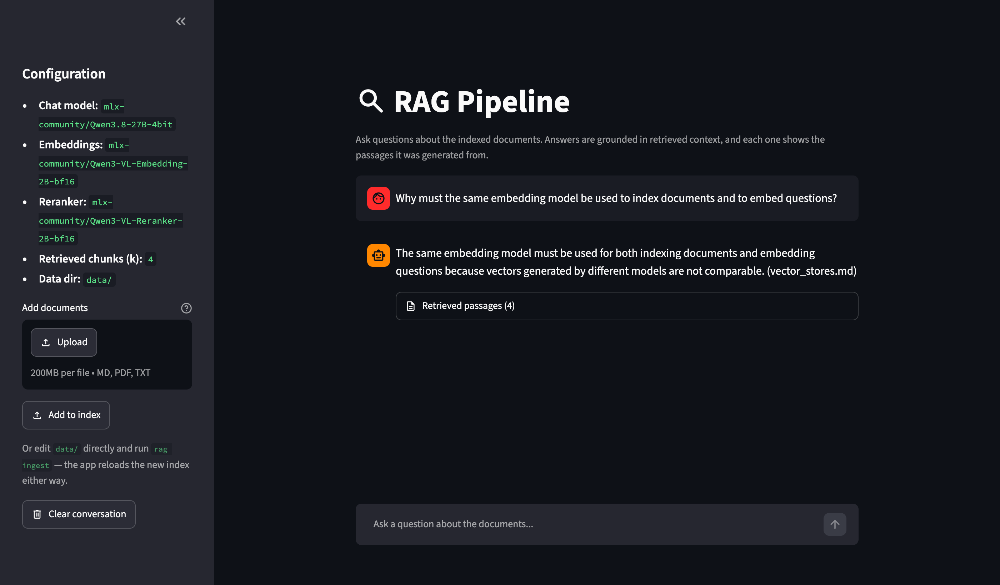
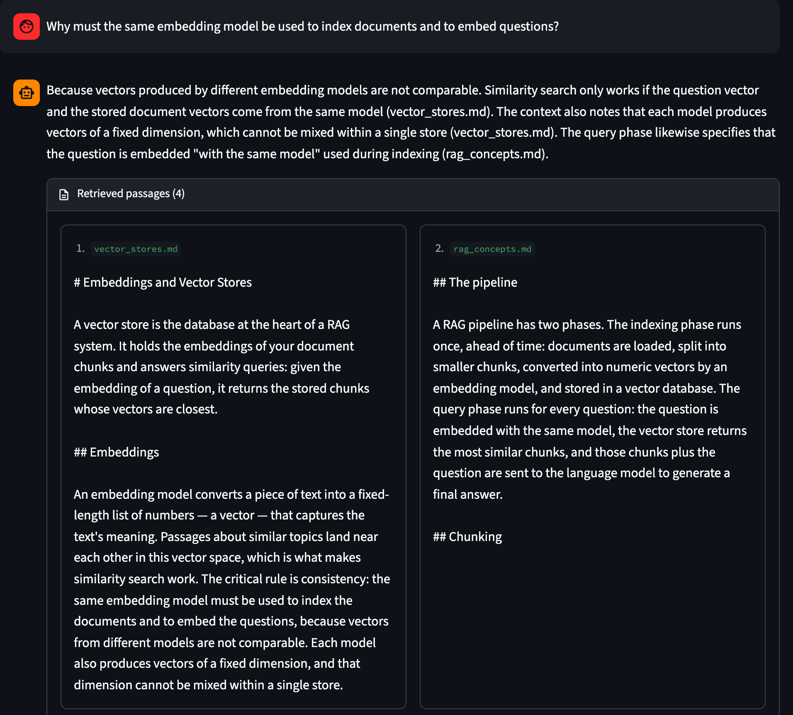

# RAG Pipeline

A small, readable **Retrieval-Augmented Generation** pipeline built with
[LangChain](https://docs.langchain.com). Documents are embedded with
**Voyage AI**'s `voyage-4-large`, stored and searched in **MongoDB Atlas** with
Atlas Vector Search, reranked with Voyage's `rerank-3`, and answered by
**Claude Sonnet 5.5**. It ships with a reusable core library, a CLI, and a
Streamlit chat app — all sharing the same code.



```
Ingest (once):   data/ ──load──▶ split ──embed──▶ store (MongoDB Atlas + vector index)
Query (per Q):   question ──embed──▶ search ──rerank──▶ [top-k chunks + question] ──▶ Claude ──▶ grounded answer + sources
```

Everything but the code runs as a service, so your documents leave the
machine: their text and vectors are stored in a MongoDB Atlas cluster — a free
one is enough — reached through `MONGODB_URI`, Voyage AI embeds them and every
question, and each question goes to Voyage's reranker with its candidate
passages and to Anthropic's API with the passages kept. Those three accounts
are all it needs; the optional [`rag eval`](#evaluation), which scores the
pipeline, adds a LangSmith one. The chat app sends nothing else:
`.streamlit/config.toml`
switches off Streamlit's usage statistics, which its browser front end would
otherwise send to Streamlit, and its first-run prompt for an email address, and
keeps the app to this machine — though
Streamlit can still look up the machine's external IP address (see
[below](#3-or-use-the-chat-app)). Tracing keeps to it as well: it is off unless
you turn it on, and then goes to a [Phoenix](#tracing-with-phoenix) server you
run yourself. (LangSmith is not used for tracing — `rag eval` keeps its
questions and results there — but see [below](#tracing-with-phoenix) if an old
`.env` still switches LangSmith tracing on.)

**Contents** — [Prerequisites](#prerequisites) · [Setup](#setup) ·
[Usage](#usage) · [Add your own documents](#add-your-own-documents) ·
[Evaluation](#evaluation) · [Tracing with Phoenix](#tracing-with-phoenix) ·
[Configuration](#configuration) · [Development](#development) ·
[Project structure](#project-structure) · [How it works](#how-it-works) ·
[Invariants](#invariants)

## Prerequisites

- [uv](https://docs.astral.sh/uv/) and Python 3.11+, on macOS or Linux. No GPU
  and no model download: every model is an API.
- A **MongoDB Atlas** cluster. The free tier (M0) holds the index of a few
  thousand pages; [Setup](#setup) walks through creating one.
- A **Voyage AI** API key, for embedding and reranking. Each account's first
  200 million tokens per model are free, which covers indexing and querying a
  personal corpus for a long time.
- An **Anthropic** API key, for the answers. At the default settings a question
  costs about half a US cent (a few thousand tokens in, a few hundred out).
- To run the tests: **Docker** (Docker Desktop on a Mac). The suite runs
  MongoDB's `atlas-local` image, so it needs no cluster of yours.

The optional [`rag eval`](#evaluation) needs a LangSmith API key besides.

## Setup

```bash
uv sync                      # create the venv and install dependencies
```

Create an Anthropic API key in the [Claude Console](https://platform.claude.com)
for `ANTHROPIC_API_KEY`.

Then create a Voyage AI API key in the [Voyage AI dashboard](https://dashboard.voyageai.com)
for `VOYAGE_API_KEY`, and **add a payment method** there. Without one the
account is held to 3 requests and 10,000 tokens a minute — less than one ingest
batch, so even a small corpus fails to index. With one, the standard limits
(2,000 requests a minute) apply, and the free tokens are still used first.

Then point it at a MongoDB Atlas cluster. In
[Atlas](https://cloud.mongodb.com) (labels approximate):

1. Create a project, then a **Free** (M0) cluster.
2. Under **Security → Database Access**, add a database user with a password
   (an autogenerated one avoids characters that need escaping in a URI) and
   the **Read and write to any database** role — enough for `rag ingest` to
   create its collection and vector index, and no more.
3. Under **Security → Network Access**, add your current IP address. (Not
   `0.0.0.0/0`, which lets anyone on the internet try the password.)
4. On the cluster, **Connect → Drivers → Python** gives the connection string.

```bash
cp .env.example .env         # then set MONGODB_URI (password filled in), VOYAGE_API_KEY and ANTHROPIC_API_KEY
```

`.env` is git-ignored, and the app never displays any of the three. A free cluster that
goes unused for a long time is paused; resume it in Atlas if the app suddenly
cannot reach it. Everything else in `.env` is an optional override (see
[Configuration](#configuration)).

## Usage

### 1. Build the index

```bash
uv run rag ingest
```

Loads the `.md`/`.txt`/`.pdf` files under `data/` — recursively, matching the
extension case-insensitively — splits them into overlapping chunks, embeds them
with Voyage AI, and stores them in the Atlas collection `rag_db.rag_docs`. The
first run creates that collection and its Atlas Vector Search index, and every
run waits until what it wrote is searchable, so a question asked right after an
ingest finds it. Ingest never calls Claude.

A file it cannot use is skipped rather than aborting the run: an unreadable one
(bad encoding, corrupt PDF, permissions) warns on stderr, and one that yields no
text is dropped silently. The silent case is the one to know about — it includes
a scanned, image-only PDF, whose text extraction returns empty without failing.

Re-run it whenever the documents change. It is incremental: each document is
fingerprinted, and only new, edited, or removed ones are re-embedded, so adding
one file to a large corpus costs one file rather than the corpus, in time and
in Voyage tokens. Afterwards the collection
holds exactly what is in `data/`, so deletions and edits are picked up too,
there are never duplicates, and any unrelated documents sharing the collection
are left alone. Re-running with nothing changed makes no embedding calls at all.

Changing `EMBEDDING_MODEL`, `EMBEDDING_DIMENSIONS`, `CHUNK_SIZE` or
`CHUNK_OVERLAP` re-embeds everything, since all four change what the stored
vectors represent. A change to the vectors' *width* (`EMBEDDING_DIMENSIONS`) also
needs a new `COLLECTION_NAME`: a vector index serves one width only. Ingest
checks this before it deletes anything and stops with an error saying so.

One ingest writes to a collection at a time. A second one — a terminal `rag
ingest` while the app is indexing an upload, or another machine — waits for the
first rather than writing alongside it, because two writers at once would each
delete what the other just added. The lock is a lease held in Atlas itself, so
it covers every process and machine, and an ingest that dies holds it for at
most five minutes.

### 2. Ask questions from the terminal

```bash
uv run rag query "What is chunking and why do we overlap chunks?"
```

Streams the grounded answer as Claude writes it, then prints the source files
it drew from. Ctrl-C abandons an answer (exit status 130) and ends the request
to Claude with it, so an abandoned answer stops being generated — and billed —
there.

### 3. Or use the chat app

```bash
uv run streamlit run streamlit_app.py
```

A browser chat UI over the same pipeline, streaming each answer token by token,
with a sidebar showing the active configuration and a per-answer panel of the
retrieved passages themselves — so a claim can be checked against the text it
was generated from, not just against a filename.



Only this machine can reach it. Streamlit otherwise listens on every network
interface, and the app has no login: anyone on your network could ask it about
your documents, read the passages it retrieves, or upload files into `data/` to
be indexed. So `.streamlit/config.toml` sets `server.address` to `127.0.0.1`,
the address Streamlit then prints and opens. That also skips a request Streamlit
otherwise makes at startup when run headless (`--server.headless true`): it asks
checkip.amazonaws.com for the machine's external IP address, to print it. To
open the app to your network deliberately, pass `--server.address 0.0.0.0` —
which, headless, brings that request back. One case makes that request
whatever the address: a connection to the app from another origin — a page on
another website, say. Streamlit refuses it, but first looks up the external IP
address, since a page served from that address is one it would allow. The
request carries nothing about the app.

Opening the app connects to the index and the model APIs, behind a spinner;
after that the connections are kept for the life of the server, including
across the index rebuilds an upload or a `rag ingest` triggers. The toolbar's
**Stop** ends an answer where it is — the request to Claude ends there and
then, so the rest is neither generated nor billed — and the turn stays in the
history, marked as interrupted.

Editing `streamlit_app.py` does not rerun it: `.streamlit/config.toml` turns
Streamlit's file watcher off, because on every run it walks every loaded module,
which with this many libraries loaded is wasted work on every turn. While
working on the app itself, run it with
`uv run streamlit run streamlit_app.py --server.fileWatcherType auto`.

The sidebar also takes uploads, so the whole loop — add a document, index it,
ask about it — can happen in the browser. See below.

### What to expect

Measured from a Mac in Singapore, against an M0 (free) Atlas cluster, using the
default models and settings:

| Step | Time |
| ---- | ---- |
| Connecting (`rag query`, or the app's first load) | about 1.3 s: the Atlas connection and its first round trip |
| Embedding documents (ingest) | about 435 chunks per second, in Voyage batches of 256 |
| Embedding a question | about 0.18 s, a round trip to Voyage |
| Searching the index in Atlas | about 0.4 s (median), against 0.07 s for the on-disk store of earlier versions: the round trip to the cluster |
| Reranking the 20 candidates | about 0.18 s, at Voyage |
| First word of the answer | about 0.9 s after retrieval, 1.4 s after the question (median of five) |
| The whole answer | about 2 s for a typical answer of a few sentences |

So a question takes about 2 seconds end to end, against 8–12 seconds when an
earlier version ran a 27-billion-parameter model on the Mac itself, and the
first word arrives in under a second and a half. Most of what remains is three
network round trips before Claude starts — embedding, search, rerank — so a
cluster in a region near you matters more than any setting here.

## Add your own documents

Two routes, same result:

- **From the app** — drag `.md`/`.txt`/`.pdf` files onto **Add documents** in the
  sidebar and click **Add to index**. They are written into `data/` and the index
  is refreshed on the spot — incrementally, as above — so the answer to your next
  question already includes them, with no reload and no terminal. This also works
  before any index exists, which is how a fresh checkout can be brought up
  entirely from the browser. A file whose name already exists in `data/` replaces
  it, so re-uploading a corrected document updates it rather than leaving both
  versions retrievable.
- **From the filesystem** — drop files into `data/` (the three sample files are
  just a starter corpus — delete them if you like; the one live test that asks
  about them skips without them), then re-run `uv run rag ingest`.

Either way the CLI and the app immediately answer against the new content: they
search the same Atlas collection, and the app reloads its pipeline when the
corpus fingerprint `rag ingest` stamps beside the collection changes.

Your documents stay out of git: `.gitignore` ignores everything in `data/` but
the three samples (and a `chroma_db/` left by an earlier version, which holds
your documents' text too), so a `git add -A` commits neither (`git add -f` a
file if you do mean to share it). Two exceptions. A document saved under a
sample's name replaces a tracked file, which git commits like any other edit, so
give yours names of their own. And a `DATA_DIR` pointed elsewhere inside the
checkout is not covered: list it in `.git/info/exclude`. Their text is also
stored in your Atlas cluster, which is as private as its access list and
database users. Secrets beside the code
are ignored too — `.env` and its variants such as `.env.phoenix`, and
Streamlit's `.streamlit/secrets.toml`; only the `.env.example` template is
tracked.

Uploaded filenames are treated as untrusted input: `save_upload()` reduces a name
to its final path component and rejects unsupported suffixes before writing, so
an upload cannot choose its own directory. Its docstring covers the details,
including where that boundary deliberately stops.

## Evaluation

`rag eval` scores the pipeline on a fixed set of 50 questions, so a change — a
model, a setting, a prompt — can be judged on every question at once rather than
on one answer. The questions are about `evals/corpus/`, the engineering handbook
of **Tallowmere**, a fictional freight-tracking company: 48 short documents
(49 chunks at the default chunk size) on services, deploys, incidents and
policies. `rag eval` indexes it into a collection of its own, `rag_eval`, beside
your index; it never reads or retrieves your documents, and `rag ingest` never
sees the corpus.

The company is fictional so that a question can only be answered by retrieving
the right passage: about real topics, a model can answer from what it already
knows, whatever retrieval did. And the corpus is built to be easy to get wrong —
four services documented alike with different values, a deprecated deployment
guide that contradicts the current one, a customer SLA beside the internal
SLOs — and large enough that vector search, which fetches `FETCH_K` = 20 chunks,
has to choose. (The three sample documents in `data/` make 9 chunks, and on them
every question scored 100%: nothing could fail.)

Each question gets four scores:

| Score | Passes when | Judged by |
| ----- | ----------- | --------- |
| `retrieval_hit` | a file the answer should come from is among the chunks in the prompt (not scored for the 5 questions the documents cannot answer) | the pipeline's own output |
| `retrieval_rank` | not a pass or fail: 1 divided by the rank of the first chunk from such a file — 1 for first, ½ for second, 0 if none — averaged into a mean reciprocal rank. It shows a right file slipping down the prompt before `retrieval_hit` sees it drop out | the pipeline's own output |
| `correct` | the answer matches the reference answer — or, for a question the documents cannot answer, says so rather than answering from general knowledge | Claude Opus 5.5 |
| `grounded` | every claim in the answer is supported by the chunks it was generated from | Claude Opus 5.5 |

Beside the three keys the pipeline itself needs, it reads one of its own, in
`.env` or the environment; and it uses `ANTHROPIC_API_KEY` twice over:

| Variable | Used for |
| -------- | -------- |
| `LANGSMITH_API_KEY` | The questions are uploaded as a [LangSmith](https://smith.langchain.com) dataset, and each run is recorded there as an experiment, with every answer, its retrieved passages and the judge's reasoning |
| `ANTHROPIC_API_KEY` | Claude Sonnet 5.5 answers, as in the app; Claude Opus 5.5 grades `correct` and `grounded` |

```bash
uv run rag eval                    # score, and compare with the saved baseline
uv run rag eval --save-baseline    # score, and save these scores as the baseline
```

A run indexes the corpus (only what changed, after the first run) and answers
every question: about 7 minutes, judging included, and an estimated $1–2 of
Anthropic API usage, almost all of it the judge. It prints each score, its change from the
baseline in `evals/baseline.json`, and a link to the experiment in LangSmith.
It stops before loading any model if a key is missing or the judge or LangSmith
cannot be reached.

Some things to know:

- **What leaves this machine** is the eval corpus, its questions, the passages
  retrieved from it and the answers, sent to Voyage AI, Atlas, Anthropic and
  LangSmith. Your own documents are never part of a run.
- **Scores compare only within one question set and one judge.** The dataset's
  name is derived from the questions' content, so editing `evals/questions.json`
  starts a new dataset, and the report then declines to compare with a baseline
  scored on the old one. The judge is fixed in code (`JUDGE_MODEL` in
  `rag_pipeline/evaluation.py`) for the same reason, and never falls back to
  another model when it declines to grade: a declined grade is recorded as
  unscored.
- **A baseline needs every question scored.** `--save-baseline` refuses a run in
  which a question failed or a grade was declined.
- **Only the eval talks to LangSmith.** It does not switch LangSmith tracing on
  for anything else.

## Tracing with Phoenix

Optional, and off unless you set it up. With it on, every question — from the
terminal or the app — is recorded as one trace in
[Arize Phoenix](https://github.com/Arize-ai/phoenix), an open-source LLM
observability server that you run on your own machine:

```
RAGPipeline                 CHAIN      the question, and the answer
├─ VectorStoreRetriever     RETRIEVER  the FETCH_K candidates the vector search returned
├─ VoyageAIRerank           RERANKER   those candidates in; the RETRIEVAL_K kept, with scores, out
└─ generate                 CHAIN
   ├─ ChatPromptTemplate    PROMPT     the prompt, with the passages filled in
   └─ ClaudeChatModel       LLM        the messages, the answer, token counts, finish reason
```

Start the server (no Docker: `uvx` fetches it into uv's cache on the first run,
about 670 MB and a minute or so), leaving it running in its own terminal:

```bash
PHOENIX_HOST=127.0.0.1 PHOENIX_ALLOW_EXTERNAL_RESOURCES=false \
  uvx --from arize-phoenix phoenix serve
```

Then point the pipeline at it in `.env`:

```bash
PHOENIX_COLLECTOR_ENDPOINT=http://localhost:6006
```

and open <http://localhost:6006>. Traces are filed under the `rag-pipeline`
project (`PHOENIX_PROJECT`), which the first one creates, and Phoenix keeps
them in SQLite under `~/.phoenix` (`PHOENIX_WORKING_DIR` moves it).

- **A trace holds everything:** the question, every retrieved passage in full,
  the prompt and the answer. Phoenix has no login by default, and it listens
  on every network interface, which would open all of that to your local
  network. `PHOENIX_HOST=127.0.0.1` keeps it to this machine. Keep it private
  that way rather than with Phoenix's own authentication: the pipeline sends no
  credentials, so an authenticated Phoenix refuses every trace (a `401` on
  stderr). Its gRPC collector (port 4317) listens on every interface regardless.
  The pipeline sends over HTTP and never uses it, but it will accept spans from
  the network.
- **What still leaves the machine:** `PHOENIX_ALLOW_EXTERNAL_RESOURCES=false`
  turns off the server's usage telemetry and its docs-assistant connection. It
  cannot stop two things. On its first start in a working directory, the server
  downloads a 26 MB WebAssembly runtime from GitHub. And while the UI is open,
  the browser asks PyPI for the latest release and GitHub for the star count.
  Neither carries trace data.
- **Stopping an answer is not a failure:** a Stop in the app, or Ctrl-C at the
  terminal, gives the root span a `stopped` event and the partial answer, and
  leaves its status unset. LangChain's own spans for the generation do show an
  error — the model's always, and on Ctrl-C the `generate` chain's too —
  because LangChain reports a closed or interrupted stream to its tracer as
  one.
- **If Phoenix is down, answers are unaffected.** Spans are sent from a
  background thread. Each batch that fails is logged on stderr as it fails (a
  `Transient error ... Connection refused` warning, then `Failed to export spans
  batch ...` — `span batch` before OpenTelemetry 1.45), so at a terminal these
  lines can land in the middle of a streaming answer. Whatever is still queued
  is tried once more at exit, where a `rag query` waits about a second longer
  — about two for a remote host that never answers (four before OpenTelemetry
  1.45).
- **Only questions are traced.** Nothing in ingest is a LangChain run.
- **LangSmith is not used for tracing — but an old `.env` may still switch it on.**
  langchain-core still acts on `LANGSMITH_TRACING=true` (or
  `LANGCHAIN_TRACING_V2=true`) by itself, and while either is set it uploads
  every question — the prompt, every retrieved passage and the answer — to
  LangSmith's cloud, whether or not Phoenix is on. Earlier versions of
  `.env.example` suggested them, so delete them from your `.env`.

## Configuration

`MONGODB_URI`, `VOYAGE_API_KEY` and `ANTHROPIC_API_KEY` are required (see
[Setup](#setup)); they are credentials, not settings, so it has no default and the app never displays it. Every setting has
a default and can be overridden in `.env` (see `.env.example`) or the
environment:

| Variable            | Default            | Purpose |
| ------------------- | ------------------ | ------- |
| `CHAT_MODEL`        | `claude-sonnet-5-5` | Claude model that writes the answers. The request is built for Claude Sonnet 5.5 — its lowest thinking setting, `between_tools`, which other models refuse — so another model needs that request changed in `claude_model.py` |
| `MAX_TOKENS`        | `1024`             | Maximum length of a generated answer, in tokens; an answer cut off there ends with a note saying so |
| `EMBEDDING_MODEL`   | `voyage-4-large`   | Voyage AI embedding model (ingest + query); any Voyage text embedding model that accepts an output dimension. A change re-embeds everything |
| `EMBEDDING_DIMENSIONS` | `1024`          | Width of the stored vectors: 256, 512, 1024 or 2048, the widths Voyage returns; a change needs a new `COLLECTION_NAME` |
| `RETRIEVAL_K`       | `4`                | Chunks kept after reranking and put in the prompt; each adds input tokens to every question |
| `FETCH_K`           | `20`               | Candidates retrieved before reranking |
| `RERANK_MODEL`      | `rerank-3`         | Voyage AI reranker |
| `CHUNK_SIZE`        | `1000`             | Characters per chunk |
| `CHUNK_OVERLAP`     | `200`              | Overlap between adjacent chunks |
| `DATA_DIR`          | `./data`           | Source documents |
| `MONGODB_DB`        | `rag_db`           | Atlas database holding the index |
| `COLLECTION_NAME`   | `rag_docs`         | Atlas collection holding the chunks and their vectors — must match between ingest and query |
| `VECTOR_INDEX_NAME` | `vector_index`     | Atlas Vector Search index over them; `rag ingest` creates it — must match between ingest and query |
| `MONGODB_TIMEOUT_MS` | `10000`           | How long to wait to reach the cluster before failing; generous because a paused free cluster resumes slowly |
| `PHOENIX_COLLECTOR_ENDPOINT` |           | Base URL of the Phoenix server to trace questions to — `http://localhost:6006` for a local `phoenix serve`. Unset, tracing is off (see [Tracing with Phoenix](#tracing-with-phoenix)) |
| `PHOENIX_PROJECT`   | `rag-pipeline`     | Phoenix project the traces are filed under; the first trace creates it |

API keys are not settings: they have no default, and are never shown in the
app's sidebar or in an error. The three the pipeline reads are in
[Setup](#setup); the one `rag eval` adds is under [Evaluation](#evaluation).

The chat app's own Streamlit settings are in `.streamlit/config.toml`, each with
a comment on why: usage statistics and the email prompt off
([above](#rag-pipeline)), and the file watcher off and the server on loopback
([the chat app](#3-or-use-the-chat-app)).

## Development

[Ruff](https://docs.astral.sh/ruff/) (lint + format) and
[ty](https://docs.astral.sh/ty/) (type check) are pinned in the dev dependency
group and configured in `pyproject.toml`. The order below is the order CI runs
them in.

### Linting and type checking

```bash
uv run ruff check --fix .    # lint, applying safe fixes
uv run ruff format .         # format
uv run ty check              # type check
```

Run `ruff check` before `ruff format` — lint fixes can reorder code that
formatting then tidies.

### Tests

```bash
uv run pytest
```

The suite needs **Docker**, and **no API keys, no network and no Atlas cluster
of yours**. It injects a deterministic fake embedding model, a fake
reranker and a fake chat model, and runs a real Atlas Vector Search: MongoDB's
`mongodb-atlas-local` image (about 1 GB, pulled on the first run), one container
for the session and one database per test. The store is the one real part,
because what matters about it — an index built asynchronously, writes that
become searchable a moment later, pre-filters on declared fields — is exactly
what a fake would have to get right. The full suite takes about four minutes on
an M2 Max, most of it building a vector index per test. Without Docker, the
tests that need the store fail with a message saying to start it. Four guards
keep the rest honest:

- Your API keys and your own `MONGODB_URI` — a real cluster — are removed for
  every test, so a test that forgets to inject a fake fails at the missing key
  instead of calling a paid API; only the container's URI is ever set.
- Every socket to a host other than this machine is blocked, so nothing reaches
  a real cluster, a model API or anywhere else.
- Tracing is forced off, whatever `.env` says. That covers Phoenix, and also
  LangSmith, which still ships inside langchain-core. A test that leaves a
  tracer switched on fails, because the tracing stack catches the socket block's
  error and only logs it, so the block alone would not notice.

Most of the tests that check traces record spans in memory. The two that check
what reaches a collector run the real exporter in a subprocess, against a
stand-in collector inside that subprocess, so the test process itself still
opens no socket. The suite runs the same on a Mac as on Linux.

It covers the configuration, the loader and splitter, ingest idempotency and
scoping, upload handling, an ingest→retrieve→generate round trip, the CLI as a
terminal program, and the Streamlit app driven headlessly — so the frontend is
covered by CI rather than by hand. The chat-model adapter in `claude_model.py`
is tested the same way, through the real Anthropic SDK against a stand-in
server: the request it sends, how it reads the stream, a refusal, a cut-off,
error translation — and that stopping an answer closes its HTTP request.
`CLAUDE.md` has the design behind the injection seam and what the app-level
tests are there to guarantee.

What the fakes cannot check is whether the models themselves are driven
correctly, so that has a suite of its own:

```bash
uv run pytest -m live
```

These tests call Anthropic's and Voyage AI's real APIs (with
`ANTHROPIC_API_KEY` and `VOYAGE_API_KEY`, for a few cents a run): about a
minute. They check that the Voyage factories embed documents and questions the
right way round, at the configured width, and that the reranker puts the
relevant passage first; that Claude streams a grounded answer with no reasoning
in it, declines what the context does not say, and reports why it stopped (the
`MAX_TOKENS` note reads it); and run an ingest-and-answer pass over `data/` on
the test container. They are the only tests allowed onto the network, and the
only ones that keep the API keys — never `MONGODB_URI`. They skip, rather than
fail, when a key is missing — and the ingest-and-answer pass skips when the
sample document its question is about is no longer in `data/`. A plain
`uv run pytest` deselects them (`addopts = ["-m", "not live"]`), so it never
calls an API. Run this suite by hand, since CI cannot, whenever what the fakes
stand in for may have moved: after changing `claude_model.py` or the factories,
and after a `uv.lock` change that moves `anthropic`, `voyageai` or
`langchain-voyageai`. A run that skipped a test has not checked it.

Coverage is measured on demand rather than in CI, and carries no threshold — a
number to keep green invites tests that execute code without asserting anything:

```bash
uv run pytest --cov=rag_pipeline --cov=streamlit_app --cov-report=term-missing
```

The lines it reports uncovered should be the ones only a real terminal or a real
API reaches: `cli.py`'s `if __name__ == "__main__"` guard, and the client
construction in each factory that the injected fakes stand in for — which is
what `-m live` is for.

### Continuous integration

`.github/workflows/ci.yml` checks every push — any branch — and every pull
request with two jobs, and a third publishes [releases](#releases) from `main`:

| Job       | Status check name                    | Runs |
| --------- | ------------------------------------ | ---- |
| `lint`    | `ruff + ty`                          | `ruff check`, `ruff format --check`, `ty check` |
| `test`    | `pytest (py3.11)`, `pytest (py3.13)` | the pytest suite on the `requires-python` floor and the version `.python-version` pins |
| `release` | `release`                            | on a push to `main`, after both: a GitHub release for a version that has none yet |

Both install with `uv sync --locked`, which fails if `uv.lock` has drifted from
`pyproject.toml` — so a dependency added by hand without re-locking is caught
rather than silently skipped.

Both run on Linux. The tests need no secrets and call no model; Docker, which
they do need for the atlas-local container, is preinstalled on the runners, and
the image is pulled in a step of its own. The `live` tests are the part CI never
runs.

Every branch push gets CI immediately, so a branch that has been broken for
several commits is visible before review rather than after. A pull request gets
a second run, on the result of merging it into its base; for a fork's, which
produces no push event here, that is the only run.

Nothing gates `main` — it accepts direct pushes, and CI reports on the result
rather than blocking it. To gate merges instead, add a repository ruleset
requiring the three `lint` and `test` status check names in the table above. To
run the same checks locally beforehand:

```bash
uv sync --locked && uv run ruff check . && uv run ruff format --check . && uv run ty check && uv run pytest
```

### Releases

A release is a version bump pushed to `main`:

```bash
uv version --bump minor    # or patch, major; updates pyproject.toml and uv.lock together
git commit -am "Release 0.2.0" && git push
```

Once lint and tests pass on that push, the `release` job tags the commit
`v0.2.0` and publishes a GitHub release listing the commits since the previous
tag. Only `main`'s head releases, though: if another push has reached `main` by
then, the release waits for a run that passes at the head, and is made from that
commit — and a version bumped again in the meantime is never released on its
own, its commits listed under the next one. On any push whose version already
has a release the job stops there, and a push whose release failed is retried by
the next push to `main`. A `v0.2.0` tag already on another commit (pushed by
hand, or left by a deleted release) fails the job until the tag is deleted or
the version bumped. Edit the version by hand and forget to re-lock, and CI fails
at `uv sync --locked`, since `uv.lock` records it too. A pre-release version
(`0.2.0rc1`) is published as a pre-release. Nothing is
built or attached — GitHub adds the source archives itself, and the wheel would
lack the chat app — and nothing goes to PyPI, where the name `rag-pipeline` is
taken.

## Project structure

```
rag_pipeline/
  config.py      Settings, loaded from environment variables
  ingest.py      load → split → embed → store (build_embeddings and open_store live here)
  pipeline.py    RAGPipeline: open the index + models, stream_answer(...) / answer(...)
  claude_model.py  Claude behind LangChain's chat-model interface
  tracing.py     optional tracing to a self-hosted Phoenix (setup_tracing)
  evaluation.py  rag eval: the questions as a LangSmith dataset, scored by Claude
  cli.py         rag ingest | rag query "..." | rag eval
streamlit_app.py Streamlit chat UI
.streamlit/      config.toml: usage statistics, email prompt and file watcher off, loopback only
data/            sample documents; add your own (git-ignored)
docs/            the README's screenshots
evals/           rag eval's corpus/ (a fictional handbook), questions.json about it, and baseline.json
```

## How it works

- **Voyage AI embeddings** (`voyage-4-large`, 1024-wide) embed documents at
  ingest and questions at query; the *same* model must embed both for their
  vectors to compare, so a single factory (`build_embeddings()`) is shared by
  ingest and query. Documents and questions are embedded asymmetrically, as
  Voyage's `input_type` asks. The clients retry a rate limit or a timeout with
  backoff, five attempts in all, and give up on a stalled call after a minute.
- **MongoDB Atlas** (`langchain-mongodb`) stores the chunks with their vectors,
  and an Atlas Vector Search index — created by `rag ingest`, with the two
  fields searches filter on — finds the nearest ones to a question. Every chunk
  this pipeline writes carries a marker, and every read, delete and search is
  filtered on it, so a collection shared with other data is never read, deleted
  from, or cited. The factory that opens the store (`open_store()`) lives in
  `ingest.py` and is imported by the query side, so both open it the same way,
  and the whole process shares one MongoDB client.
- **Voyage AI reranking** (`rerank-3`) sharpens retrieval: vector search casts
  a wide net (`FETCH_K` candidates), then the reranker scores each candidate
  against the question *jointly*, which embedding similarity only
  approximates, and keeps the top `RETRIEVAL_K`. This is the
  single query-time factory that lives in `pipeline.py` rather than `ingest.py`,
  because reranking has no ingest-side counterpart.
- **Claude Sonnet 5.5** writes the answer, prompted to answer only from the
  retrieved context and to cite its sources, which is what turns a general chat
  model into a document-grounded question-answerer. Thinking is at its lowest
  setting (with no tools in the request, none at all) and effort is low: an
  answer from a few retrieved passages needs neither, and both add to the wait
  before the first word. Claude takes no sampling parameters, so the same
  question over the same context can be worded differently from one run to the
  next; what keeps answers checkable is the grounding, and the cited passages
  the app shows beside them. A question Claude declines is reported as declined,
  never as an empty answer. Both frontends stream it: `stream_answer(question)` hands
  back the retrieved sources and a lazy stream of the answer together, and
  `answer()` — for library callers who just want the finished string — is a join
  over the same path.

Stopping an answer — the app's Stop, Ctrl-C in `rag query` — closes its request
to Claude, so generation, and billing, stop there rather than running on to
`MAX_TOKENS`. LangChain's own Anthropic integration leaves that request open,
which is why `claude_model.py` has an adapter of its own.

Swapping a model is a one-line change in `.env` for any Voyage embedding model
or reranker (`EMBEDDING_MODEL`, `RERANK_MODEL`); another Claude model for
`CHAT_MODEL` also needs the request in `claude_model.py` changed to suit it. Another provider's embedder or reranker is a code change in the
factories, `build_embeddings()` and `build_reranker()`. Swapping the vector store
is a code change too: `open_store()` in `ingest.py` is the single place the
vector store is constructed, so it is the main place to edit — though the
incremental bookkeeping in `ingest()`, the index management and the writer lock
also speak MongoDB's queries directly.

## Invariants

A few of this project's rules are properties of the source *text* rather than of
its behavior — they say some call never happens, so there is nothing to observe.
Those live as data in `tests/invariants.py`, and `tests/test_invariants.py`
enforces them across every `.py` file git does not ignore, added or not:

| Rule                 | Forbids                                                        | Why |
| -------------------- | -------------------------------------------------------------- | --- |
| `store-factory`      | constructing the vector store (`MongoDBAtlasVectorSearch(...)`, `MongoDBAtlasVectorSearch.from_*(...)` or `MongoClient(...)`) outside `ingest.py`, `tests/` included — `tests/conftest.py`, which administers the test container, excepted | the store's identity is (`MONGODB_URI`, database, collection, vector index, embedding function); ingest and query must open it the same way, through the one client the process shares |
| `embeddings-factory` | constructing an embedding model (`VoyageAIEmbeddings(...)` or `HuggingFaceEmbeddings(...)`) outside `ingest.py`, `tests/` included — a class definition of that name excepted | the same model must embed documents and questions; in tests, inject a fake instead |
| `no-suppressions`    | a suppression in source that ruff or ty honours: `noqa` (in any case, and in ruff's and flake8's file-level forms), ruff's `ignore[…]`, `file-ignore[…]` and `disable[…]`, isort's `skip`, `skip_file`, `off` and `split`, `ty: ignore` and `type: ignore` (with or without codes), and `@no_type_check` — though not `# fmt:` directives, under which the linter still reports everything | fix the finding instead |

Two documentation rules ride along: every `Settings` field must appear in both
`.env.example` and the configuration table above, and every rule in the table
above must have its row — `test_every_setting_is_documented` and
`test_every_rule_is_documented` are what catch either falling behind, since
`ruff`, `ty` and the rest of the suite stay green against stale docs.

Everything else is asserted where the behavior is, because a test observes the
property while a rule only matches spellings. See CLAUDE.md's *Enforcing the
invariants* for those and for the reasoning behind the split.
